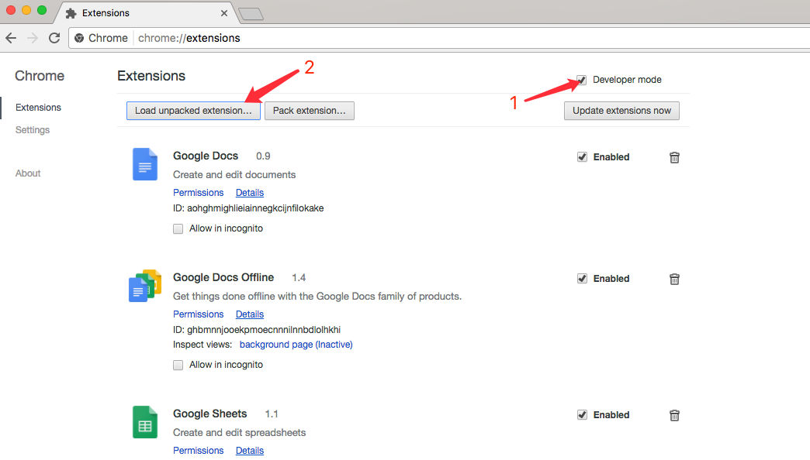
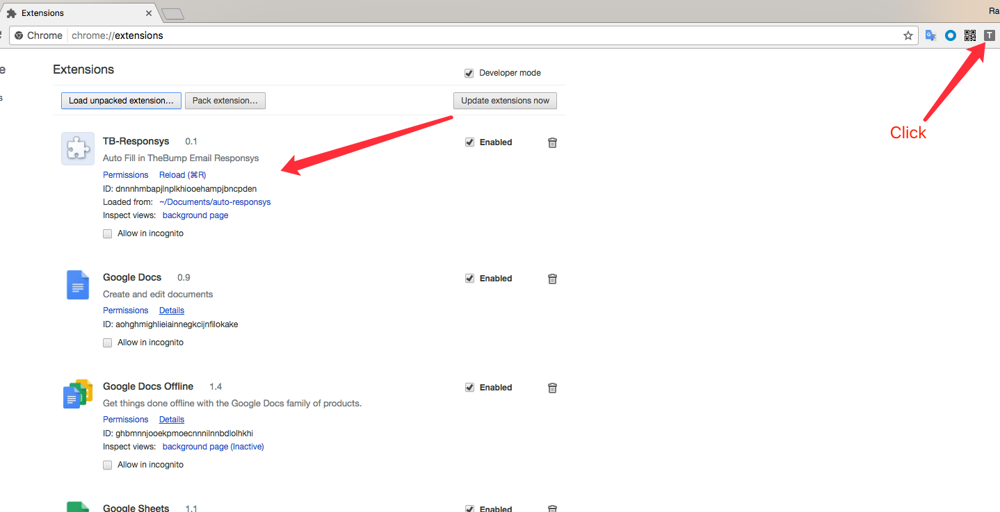

### Setup

Install NodeJs

    $ brew install node

Then install webpack

    $ npm install -g webpack

Compile with webpack

    $ cd /path/to/auto-responsys && webpack

### Install extension

Open chrome browser and go to [chrome://extensions](chrome://extensions).

Check "Developer mode".

Click "Load uppacked extension".

Select the auto-responsys folder. And then you will see

